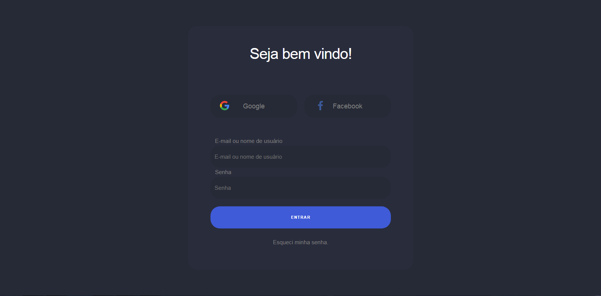

# Tela de login simples com tema escuro e responsiva.
#### Para desenvolver essa página, foi utilizado skeleton css e normalize css.
#### Ícones obtidos em https://worldvectorlogo.com/pt/termos-de-uso

# Tela completa

#
# Tela mínima

  <a href="https://felipesntr.github.io/demos/login-simples/login.html">ONLINE EXEMPLE</a>

# License
### This project is licensed under the MIT License.
